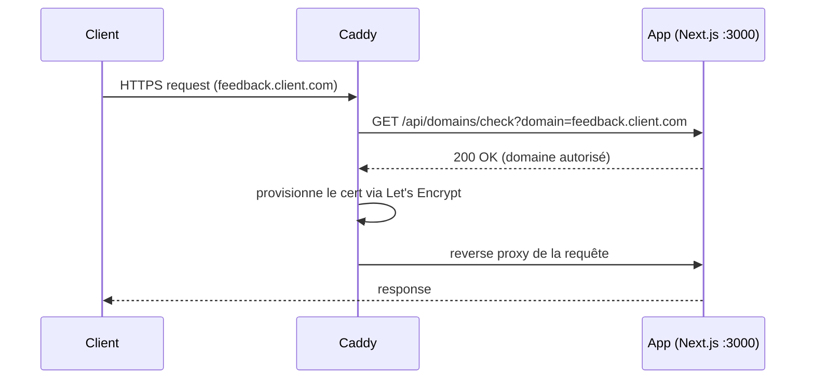

# Caddy — Domain provider pour custom tenant domains

Caddy sert de **reverse proxy avec on-demand TLS** pour permettre à vos tenants d'utiliser leur propre domaine personnalisé (`feedback.client.com` → votre instance).

## Quand utiliser Caddy ?

Si vous voulez offrir la feature **custom domain par tenant**, vous avez besoin d'un mécanisme pour :
1. Accepter des domaines arbitraires côté proxy
2. Provisionner les certificats TLS à la volée
3. Valider que le domaine est bien rattaché à un tenant

Caddy fait les trois via [on-demand TLS](https://caddyserver.com/docs/automatic-https#on-demand-tls). Avant d'émettre un cert, Caddy interroge un endpoint `ask` qui doit retourner 200 si le domaine est autorisé.



Si vous n'avez pas besoin de custom domains tenants, vous pouvez utiliser n'importe quel reverse proxy (Traefik, nginx, Caddy avec un Caddyfile statique) sans cette mécanique.

## Alternatives

Caddy n'est pas le seul provider domain disponible. Le code supporte aussi :

| Provider | `DOMAIN_PROVIDER` | Cas d'usage |
|----------|------------------|-------------|
| Caddy | `caddy` | VPS, docker-compose, kubernetes ; vous opérez le proxy |
| Scalingo | `scalingo` | App hébergée Scalingo ; délégation à l'API Scalingo |
| Clever Cloud | `clevercloud` | App hébergée Clever Cloud ; délégation à l'API CC |
| Noop | `noop` | Pas de custom domains (mono-domaine ou sous-domaines wildcards uniquement) |

## Configuration

### Variables d'environnement (app web)

```bash
DOMAIN_PROVIDER="caddy"
DOMAIN_CADDY_ADMIN_URL=http://caddy:2019      # API admin Caddy (health check)
DOMAIN_CADDY_ASK_URL=http://app:3000/api/domains/check
DOMAIN_CADDY_UPSTREAM=app:3000                # upstream Next.js
```

### Endpoint de validation

`GET /api/domains/check?domain=example.com`

- `200 OK` : domaine autorisé (custom domain existant en DB ou sous-domaine de votre domaine principal)
- `404 Not Found` : domaine inconnu (Caddy ne provisionnera pas de cert)
- `400 Bad Request` : paramètre `domain` manquant

## Déploiement

### Docker Compose

Le fichier [`docker-compose.caddy.yml`](./docker-compose.caddy.yml) lance Caddy avec le `Caddyfile` monté en lecture seule et des volumes persistants pour les certs.

```bash
docker compose -f docker-compose.caddy.yml up -d
```

À configurer côté env :
- `DOMAIN_CADDY_ASK_URL` : URL complète de l'endpoint de validation (accessible depuis le container Caddy)
- `DOMAIN_CADDY_UPSTREAM` : adresse de l'app (nom du service Docker ou IP)

### Kubernetes

```bash
kubectl apply -f k8s/
```

Les manifests incluent :
- [`configmap.yaml`](./k8s/configmap.yaml) : Caddyfile monté en volume
- [`deployment.yaml`](./k8s/deployment.yaml) : Pod Caddy avec volume persistant pour les certs
- [`service.yaml`](./k8s/service.yaml) : Service LoadBalancer 80/443

Adapter `DOMAIN_CADDY_ASK_URL` et `DOMAIN_CADDY_UPSTREAM` dans `deployment.yaml`.

### VPS (systemd)

1. Installer Caddy : https://caddyserver.com/docs/install
2. Copier le Caddyfile :
   ```bash
   sudo cp Caddyfile /etc/caddy/Caddyfile
   ```
3. Configurer les variables dans `/etc/caddy/environment` :
   ```bash
   DOMAIN_CADDY_ASK_URL=http://localhost:3000/api/domains/check
   DOMAIN_CADDY_UPSTREAM=localhost:3000
   ```
4. Démarrer :
   ```bash
   sudo systemctl enable --now caddy
   ```

## DNS côté tenant

Pour chaque domaine custom, le client final doit configurer un record DNS pointant vers votre serveur Caddy :

```
feedback.client.com.  CNAME  caddy.votre-instance.com.
```

Pour les sous-domaines de votre domaine principal, un wildcard DNS suffit :

```
*.votre-instance.com.  CNAME  caddy.votre-instance.com.
```

Voir [`docs/self-host/dns-provider/`](../../dns-provider/) pour automatiser la création de records DNS côté votre infra (par ex. CNAME de vérification pour onboarder un nouveau custom domain).
