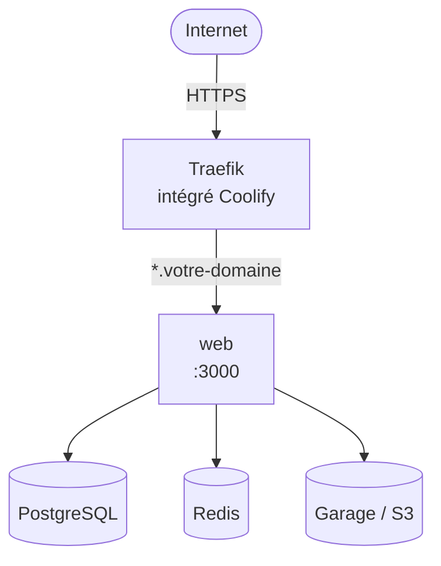

# Coolify (self-host)

Ce guide assume que **vous avez déjà une instance [Coolify](https://coolify.io/) fonctionnelle** (proxy Traefik configuré, certificats Let's Encrypt opérationnels, DNS qui résolvent vers votre serveur). Il couvre uniquement le déploiement de Roadmaps Faciles à l'intérieur de votre Coolify, pas son installation.

> Pour installer Coolify : [docs officielles](https://coolify.io/docs/installation). Pour la config wildcard cert via DNS challenge, voir la [doc Traefik](https://doc.traefik.io/traefik/https/acme/).

## Architecture cible



Trois services dépendances à créer (ou réutiliser s'ils existent déjà) dans votre Coolify : PostgreSQL, Redis, et un S3-compatible (Garage recommandé pour le self-host, MinIO ou un service externe sont des alternatives).

## Deux approches

| Approche | Pour qui ? | Format dans Coolify |
|----------|-----------|---------------------|
| **Pull image GHCR** | Production : tag image stable, mises à jour explicites | Resource "Docker Image" pointant vers `ghcr.io/roadmaps-faciles/roadmaps-faciles-web:<tag>` |
| **Docker Compose** | Self-host plus contrôlé : un seul project Coolify avec web + dépendances | Resource "Docker Compose" qui référence le compose unifié de [`../docker-compose/`](../docker-compose/) |

Les deux approches **n'ont pas besoin de fork du repo ni de webhook GitHub**. Vous tirez notre image publiée sur GHCR (ou notre docker-compose), et vous mettez à jour le tag quand vous voulez (manuellement ou via un schedule Coolify).

## Approche 1 : pull image GHCR (recommandée)

### Créer les services dépendances

Dans votre project Coolify, créer :

#### PostgreSQL

Service Postgres Coolify standard. Coolify provisionne le user `postgres` et une DB par défaut. Renommer la DB en `roadmaps-faciles` (ou ajuster `DATABASE_URL` côté web).

Activer le backup managé Coolify pour la prod (vers un bucket S3 ou un volume distant).

#### Redis

Service Redis Coolify standard. Pas de backup nécessaire (cache volatile).

#### Garage (S3-compatible)

Roadmaps Faciles utilise du S3-compatible storage pour les uploads. Garage est recommandé pour le self-host (single binary Rust, ~50 MB RAM en single-node).

Créer un service "Docker Compose" Coolify avec :

```yaml
services:
  garage:
    image: dxflrs/garage:v2.3.0
    command: ["/garage", "server", "--single-node", "--default-bucket"]
    environment:
      GARAGE_DEFAULT_BUCKET: roadmaps-faciles
      GARAGE_DEFAULT_ACCESS_KEY: ${GARAGE_DEFAULT_ACCESS_KEY}
      GARAGE_DEFAULT_SECRET_KEY: ${GARAGE_DEFAULT_SECRET_KEY}
    volumes:
      - ./garage.toml:/etc/garage.toml:ro
      - garage_meta:/var/lib/garage/meta
      - garage_data:/var/lib/garage/data

volumes:
  garage_meta:
  garage_data:
```

Générer les credentials avant le premier boot :

```bash
GARAGE_DEFAULT_ACCESS_KEY="GK$(openssl rand -hex 16)"
GARAGE_DEFAULT_SECRET_KEY="$(openssl rand -hex 32)"
```

Le fichier `garage.toml` (config minimale single-node + `rpc_secret`) est dans [`../docker-compose/garage.toml`](../docker-compose/garage.toml).

Avec `--single-node --default-bucket`, le bucket et l'access key sont créés automatiquement au premier boot. Pas de `garage layout assign` manuel.

> **Alternative MinIO** : image `minio/minio`, env vars `MINIO_ROOT_USER` + `MINIO_ROOT_PASSWORD`, port 9000 (S3) + 9001 (console). Bucket créé après boot via `mc mb`.

> **Alternative S3 externe** : Scaleway Object Storage, Backblaze B2, AWS S3, etc. Pas de service à créer côté Coolify, juste les credentials à passer en env vars de l'app web.

### Créer le service web

Nouvelle resource Coolify type "Docker Image" :

- **Image** : `ghcr.io/roadmaps-faciles/roadmaps-faciles-web:<tag>`
  - `latest` : image dev (instable)
  - `main` : dernière build de main
  - `v1.2.3` : release stable (recommandé pour prod)
  - `dev` : nightly de dev
- **Port** : 3000
- **Domaines** : `votre-domaine.com` + `*.votre-domaine.com` avec votre resolver wildcard cert Traefik

> **Limitation Traefik v3 + wildcard SNI** : si vous combinez le wildcard cert avec `Host(*.x.y)`, Traefik génère `HostSNI(*.x.y)` qui est invalide. Solution : configurer la route wildcard via fichier dynamique Traefik avec `HostRegexp`. Exemple :
> ```yaml
> # /data/coolify/proxy/dynamic/rmf-wildcard.yml
> http:
>   routers:
>     rmf-wildcard:
>       entryPoints: [https]
>       rule: "HostRegexp(`^.+\\.votre-domaine\\.com$`)"
>       service: rmf-web
>       tls:
>         certResolver: letsencrypt
>         domains:
>           - main: votre-domaine.com
>             sans: ["*.votre-domaine.com"]
>   services:
>     rmf-web:
>       loadBalancer:
>         servers:
>           - url: 'http://rmf-web:3000'
> ```
> L'UI Coolify casse cette config si on touche aux domaines après ; ne plus toucher au domaine côté UI une fois la route dynamique en place.

### Variables d'environnement (web)

Liste exhaustive dans [`apps/web/src/config.ts`](../../../../apps/web/src/config.ts). Variables critiques :

```bash
NODE_ENV=production
AUTH_TRUST_HOST=1
AUTH_URL=https://votre-domaine.com/api/auth        # URL complète obligatoire
AUTH_SECRET=<32 bytes random>
SECURITY_JWT_SECRET=<random>
SECURITY_WEBHOOK_SECRET=<random>
INTEGRATION_ENCRYPTION_KEY=<random>

DATABASE_URL=postgresql://postgres:<pwd>@<postgres-service>:5432/roadmaps-faciles?schema=public
REDIS_URL=redis://<redis-service>:6379

# Storage (Garage local, exemple)
STORAGE_PROVIDER=s3
STORAGE_S3_ENDPOINT=http://garage:3900
STORAGE_S3_REGION=garage
STORAGE_S3_BUCKET=roadmaps-faciles
STORAGE_S3_ACCESS_KEY_ID=GK<hex32>
STORAGE_S3_SECRET_ACCESS_KEY=<hex64>
STORAGE_S3_PUBLIC_URL=https://votre-domaine.com/api/uploads    # stream via app
STORAGE_MAX_FILE_SIZE_MB=5

# SMTP
MAILER_SMTP_HOST=smtp.example.com
MAILER_SMTP_PORT=587
MAILER_SMTP_SSL=false                # 587 STARTTLS, true pour 465
MAILER_SMTP_LOGIN=<user>
MAILER_SMTP_PASSWORD=<password>
MAILER_FROM_EMAIL="Roadmaps <noreply@votre-domaine.com>"

# Multi-tenant : ajouter les hostnames internes utilisés par les healthchecks Coolify
ADDITIONAL_ROOT_DOMAINS=localhost:3000

# Admins (usernames super-admin, séparés par virgule)
ADMINS=<your-username>
```

### Healthcheck

L'image Dockerfile inclut un `HEALTHCHECK` sur `GET /api/healthz`. Coolify le détecte automatiquement.

> **Gotcha IPv4/IPv6** : le healthcheck du Dockerfile utilise `127.0.0.1` et non `localhost` pour éviter la résolution `::1` qui échoue dans certaines configs container.

## Approche 2 : Docker Compose

Si vous voulez moins de friction de setup ou tout déployer en un seul project Coolify, utiliser le compose unifié de [`../docker-compose/`](../docker-compose/).

Dans Coolify : créer une resource "Docker Compose Empty" et coller le contenu de [`../docker-compose/docker-compose.yml`](../docker-compose/docker-compose.yml). Configurer le `.env` côté Coolify avec les variables documentées dans [`../docker-compose/.env.example`](../docker-compose/.env.example).

Avantages : un seul project, dépendances inclues, healthcheck inter-services automatique. Inconvénient : pas de backup managé Coolify par service (à scripter côté volumes).

## Mises à jour

Coolify ne tire pas automatiquement les nouveaux tags GHCR. Trois options pour upgrader :

1. **Manuel** : changer le tag dans la resource Coolify (`v1.2.3` → `v1.3.0`) et redéployer
2. **Schedule** : créer un cron Coolify qui pull `latest` ou `main` à intervalle régulier (1-2 fois par semaine en staging, manuel en prod)
3. **Webhook externe** : votre CI émet un webhook Coolify de redéploiement après publication d'une nouvelle release

Pas de fork du repo nécessaire, pas de webhook GitHub à configurer côté Coolify.

## Points à valider en condition réelle

- **Cold start container** : Next.js standalone + `prisma migrate deploy` + seed conditionnel → mesurer le temps d'init (acceptable < 30s)
- **Backups Postgres** : configurer + tester un restore avant de mettre du trafic critique
- **Stockage S3 uptime** : Garage/MinIO en single-node est un point de défaillance ; prévoir backup des volumes (snapshot LVM/ZFS ou rclone vers stockage externe)
- **Wildcard cert renewal** : Let's Encrypt renouvelle 30 jours avant expiration, vérifier les logs Traefik pour confirmer le DNS challenge OK avant l'expiration du premier cert

## Custom domains tenants

Pour permettre à vos tenants d'utiliser leur propre domaine (`feedback.client.com`), il faut un mécanisme on-demand TLS. Traefik ne le supporte pas nativement bien.

Solutions :
- Déployer Caddy en complément (cf. [`../../domain-provider/caddy/`](../../domain-provider/caddy/)) en mode reverse-proxy devant Coolify pour cette feature uniquement
- Utiliser un autre proxy supportant on-demand TLS (Caddy, certaines configs nginx + acme.sh)

Si vous n'avez pas besoin de cette feature, vos tenants utilisent uniquement les sous-domaines `tenant.votre-domaine.com` couverts par le wildcard cert.
