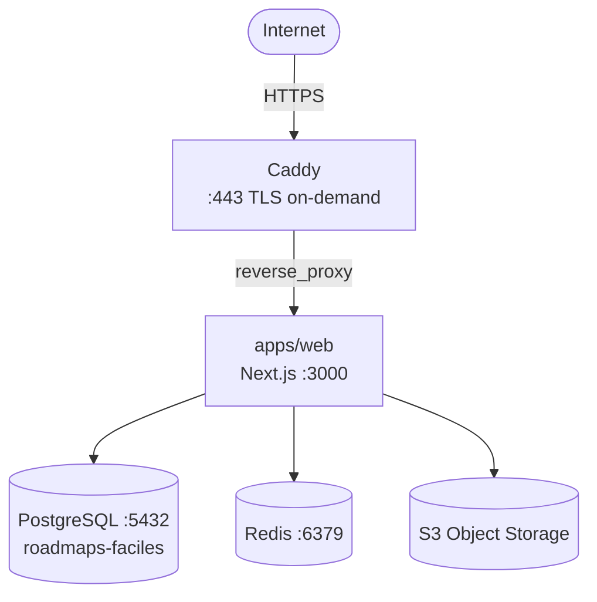
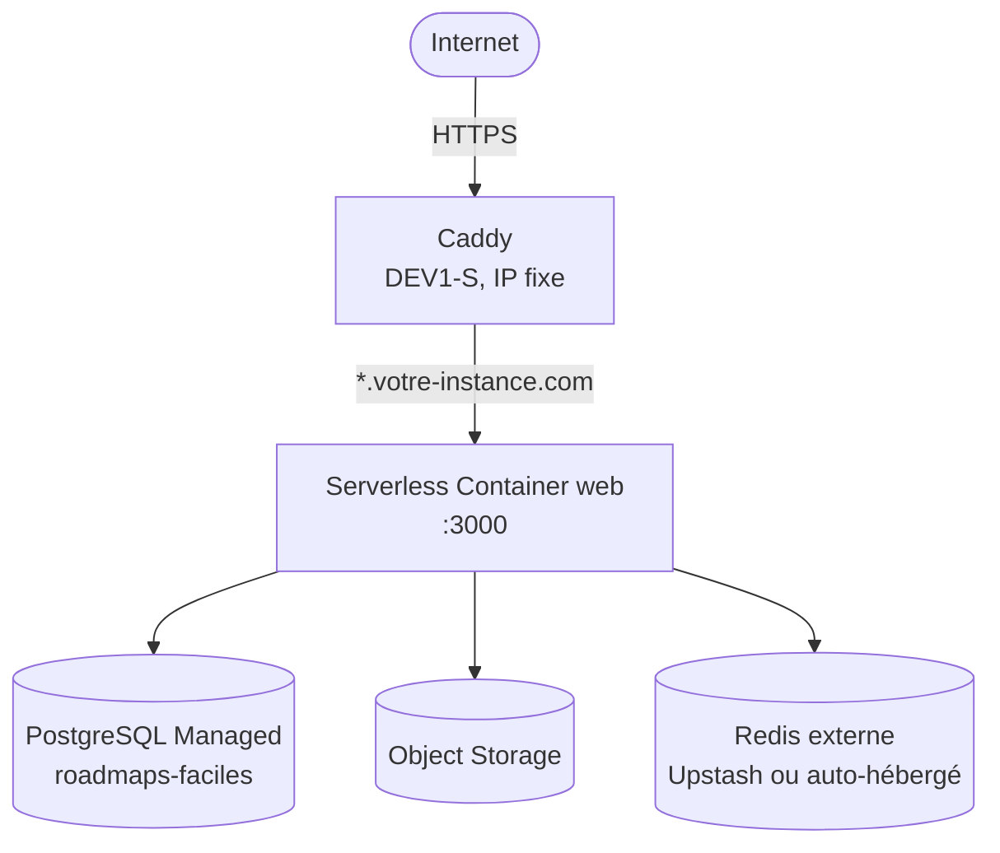

# Scénario IaaS : Scaleway (ou équivalent)

Guide d'architecture pour déployer Roadmaps Faciles sur une infra IaaS (Scaleway, OVH Cloud, Hetzner, AWS, etc.). Vous gérez tout : compute, DB, Redis, TLS, stockage.

> **Raccourci** : un setup OpenTofu complet est disponible dans [`tofu/`](./tofu/) ; il provisionne toute l'infra en un `tofu apply`. Voir [la section dédiée](#opentofu) plus bas.

## Vue d'ensemble



## Ce qui est à votre charge

| Brique           | Options Scaleway                                       | Alternatives               |
|------------------|--------------------------------------------------------|----------------------------|
| Compute          | Kapsule (K8s), Serverless Containers, VPS (DEV1/GP1)   | Docker Compose sur VPS     |
| PostgreSQL       | Managed Database for PostgreSQL                        | Auto-hébergé dans un container |
| Redis            | Non disponible managé                                  | Upstash, auto-hébergé, KeyDB |
| TLS + reverse proxy | :                                                   | [Caddy on-demand](../../domain-provider/caddy/) |
| Domaines custom  | :                                                      | Caddy (`DOMAIN_PROVIDER=caddy`) |
| Stockage S3      | Object Storage (natif, S3-compatible)                  | Garage ou MinIO auto-hébergé |
| DNS              | Scaleway DNS (ou externe)                              | OVH, Cloudflare            |
| Email            | Transactional Email (TEM)                              | Brevo, Mailjet, Postmark, Resend |
| Monitoring       | Cockpit (Grafana/Loki)                                 | Sentry + PostHog (SaaS)    |

## Architecture Docker Compose (VPS)

Le setup le plus simple pour un VPS unique : voir le template complet et prêt à l'emploi dans [`../docker-compose/`](../docker-compose/), qui inclut web + Postgres + Redis + Garage + Caddy en un seul `docker-compose.yml` avec `.env.example`.

## Architecture Kapsule (Kubernetes)

Pour du scaling horizontal.

| Composant       | Type K8s                                  | Replicas      |
|-----------------|-------------------------------------------|---------------|
| Caddy           | Deployment + Service LoadBalancer         | 1             |
| apps/web        | Deployment + Service ClusterIP            | 2-5 (HPA)     |
| PostgreSQL      | Scaleway Managed DB (externe au cluster)  | :             |
| Redis           | Deployment + Service ClusterIP (ou Upstash) | 1           |

Manifests Caddy : [`../../domain-provider/caddy/k8s/`](../../domain-provider/caddy/k8s/).

```bash
# Cluster
scw k8s cluster create name=roadmaps-faciles version=1.30 \
  pools.0.name=default pools.0.node-type=DEV1-M pools.0.size=2

# DB managée
scw rdb instance create name=roadmaps-faciles engine=PostgreSQL-17 node-type=DB-DEV-S
scw rdb database create instance-id=<id> name=roadmaps-faciles

# Déploiement
scw k8s kubeconfig install <cluster-id>
kubectl apply -f ../../domain-provider/caddy/k8s/
kubectl apply -f <vos-manifests>/
```

## Stockage S3 (Scaleway Object Storage)

Natif et S3-compatible. C'est la brique la plus simple à setup.

```bash
# Créer le bucket
scw object bucket create name=<your-bucket> region=fr-par
scw object bucket update name=<your-bucket> region=fr-par visibility=public-read
```

Configuration dans l'app :

```bash
STORAGE_PROVIDER=s3
STORAGE_S3_ENDPOINT=https://s3.fr-par.scw.cloud
STORAGE_S3_REGION=fr-par
STORAGE_S3_BUCKET=<your-bucket>
STORAGE_S3_ACCESS_KEY_ID=SCWxxxxxxxxxxxxxxxxx
STORAGE_S3_SECRET_ACCESS_KEY=xxxxxxxx-xxxx-xxxx-xxxx-xxxxxxxxxxxx
STORAGE_S3_PUBLIC_URL=https://<your-domain>/api/uploads
```

Structure des clés en bucket : `images/{uuid}.{ext}` (markdown embeds), `avatars/{userId}/{uuid}.{ext}` (avatars users), `tenants/{tenantId}/{logo|banner}.{ext}` (assets tenants).

Les uploads sont servis via la route `/api/uploads/[...key]` qui stream depuis le bucket. L'URL S3 directe n'est jamais exposée au client, donc `STORAGE_S3_PUBLIC_URL` pointe vers votre instance, pas vers Scaleway.

## DNS

Deux options :

1. **Scaleway DNS** : si le domaine est chez Scaleway
2. **DNS externe** (OVH, Cloudflare) : via le `DNS_PROVIDER` de l'app

Pour les sous-domaines tenants (`tenant.votre-instance.com`), un wildcard CNAME vers le serveur Caddy suffit :

```
*.votre-instance.com.  CNAME  caddy.votre-instance.com.
```

Caddy gère le TLS on-demand (interroge `/api/domains/check` avant d'émettre un certificat).

## Email

Scaleway Transactional Email (TEM) ou un SMTP externe :

```bash
# Scaleway TEM
MAILER_SMTP_HOST=smtp.tem.scw.cloud
MAILER_SMTP_PORT=465
MAILER_SMTP_SSL=true
MAILER_SMTP_LOGIN=<project-id>
MAILER_SMTP_PASSWORD=<secret-key>
```

## OpenTofu

Le répertoire [`tofu/`](./tofu/) contient une configuration OpenTofu complète qui provisionne toute l'infra Scaleway en une commande.

### Ce qui est provisionné

| Ressource         | Type Scaleway                              | Description |
|-------------------|--------------------------------------------|-------------|
| Object Storage    | `scaleway_object_bucket`                    | Bucket S3 pour les uploads |
| PostgreSQL        | `scaleway_rdb_instance` + 1 database        | DB managée `roadmaps-faciles` |
| Registry          | `scaleway_registry_namespace`               | Registry Docker privé (optionnel) |
| Container web     | `scaleway_container`                        | Serverless Container Next.js |
| VPS Caddy         | `scaleway_instance_server`                  | DEV1-S avec cloud-init (Caddy + TLS on-demand) |
| IP publique       | `scaleway_instance_ip`                      | IP fixe pour le DNS |
| DNS (optionnel)   | `scaleway_domain_record`                    | A root + wildcard |

### Usage

```bash
cd docs/self-host/hosting/scaleway/tofu

tofu init
cp staging.tfvars my-env.tfvars
# Renseigner les valeurs non-sensibles, les secrets via TF_VAR_

tofu plan -var-file=my-env.tfvars
tofu apply -var-file=my-env.tfvars
```

### Secrets

Les secrets ne doivent pas être dans les `.tfvars`. Passer via variables d'environnement :

```bash
export TF_VAR_db_password="..."
export TF_VAR_jwt_secret="..."
export TF_VAR_webhook_secret="..."
export TF_VAR_scw_access_key="..."
export TF_VAR_scw_secret_key="..."

tofu apply -var-file=my-env.tfvars
```

### Staging = Prod

Même config, juste les variables qui changent :

```bash
# Staging
tofu workspace new staging
tofu apply -var-file=staging.tfvars

# Prod
tofu workspace new prod
tofu apply -var-file=prod.tfvars  # db_node_type=DB-GP-XS, web_max_scale=5, etc.
```

### Architecture résultante



Redis n'est pas provisionné par OpenTofu car Scaleway n'a pas de Redis managé. Utiliser Upstash (serverless, free tier disponible) ou ajouter un container Redis sur le VPS Caddy.

## Différences clés avec le scénario PaaS

| Aspect | PaaS (Scalingo) | IaaS (Scaleway) | IaaS + OpenTofu |
|--------|-----------------|-----------------|-----------------|
| TLS domaines custom | Scalingo (unitaire ou wildcard) | Caddy on-demand (wildcard) | Idem, provisionné |
| Deploy | Git push (Procfile) | Docker build + push image | Idem |
| DB | Addon managé | Managed DB ou auto-hébergé | Managed DB (auto) |
| Redis | Addon managé | À provisionner | À provisionner |
| S3 | Externe obligatoire | Natif (Object Storage) | Provisionné (auto) |
| Provisioning | Manuel (console/CLI) | Manuel (console/CLI) | `tofu apply` |
| Reproductibilité | Limitée (scalingo.json) | Faible | Totale (IaC) |
| Coût fixe minimal | ~30-50 €/mois | ~15-25 €/mois | Idem |
| Complexité ops | Faible | Élevée | Moyenne |
