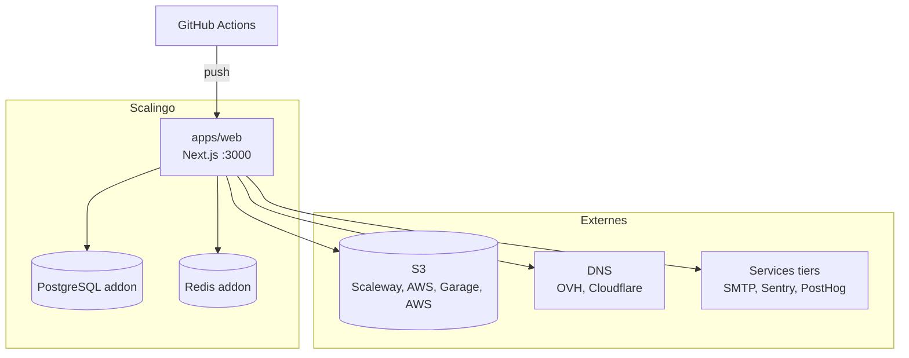

# Scénario PaaS : Scalingo

Guide d'architecture pour déployer Roadmaps Faciles sur Scalingo (ou PaaS équivalent type Clever Cloud).

## Vue d'ensemble

Scalingo gère le compute, la DB et Redis. Le stockage S3 et les services tiers (DNS, email, monitoring) sont externes.



## Ce qui est inclus / ce qui ne l'est pas

| Brique           | Fourni par Scalingo ? | Solution                                          |
|------------------|-----------------------|---------------------------------------------------|
| Compute (web)    | Oui                   | Procfile, git push deploy                         |
| PostgreSQL       | Oui (addon)           | 1 instance `roadmaps-faciles`                     |
| Redis            | Oui (addon)           | 1 instance                                        |
| TLS              | Oui                   | Let's Encrypt automatique (pas besoin de Caddy)   |
| Domaines custom  | Oui (API)             | `DOMAIN_PROVIDER=scalingo`                        |
| Stockage S3      | Non                   | Scaleway Object Storage, AWS S3, ou autre S3-compatible |
| DNS automatique  | Non                   | OVH / Cloudflare via `DNS_PROVIDER`               |
| Email (SMTP)     | Non                   | Brevo, Mailjet, Scaleway TEM, Resend, ou autre SMTP |
| Monitoring       | Non                   | Sentry (errors) + PostHog (analytics) ; optionnels |

## App Scalingo

Une seule app, avec son propre addon PostgreSQL.

**Procfile** (racine du monorepo) :

```
web: node apps/web/.next/standalone/apps/web/server.js
postdeploy: ... prisma migrate deploy ...
```

Le build Next.js produit un output `standalone`. Scalingo détecte le Procfile, build, et lance le serveur Node.

**Addons** : PostgreSQL + Redis (déclarés dans `scalingo.json`, créés automatiquement pour les review apps).

## Variables d'environnement

### Auto-configurées (review apps)

Gérées par `scalingo.json` à la création :

| Variable | Source |
|----------|--------|
| `DATABASE_URL` | `$SCALINGO_POSTGRESQL_URL` |
| `REDIS_URL` | `$SCALINGO_REDIS_URL` |
| `AUTH_URL` | générée depuis l'URL de l'app |
| `NEXT_PUBLIC_SITE_URL` | générée |
| `SECURITY_JWT_SECRET` | auto-générée |
| `SECURITY_WEBHOOK_SECRET` | auto-générée |
| `AUTH_TRUST_HOST` | `1` |

### À configurer en staging/prod

```bash
# Environnement
scalingo env-set APP_ENV=prod

# Domaines custom (Scalingo gère le TLS)
scalingo env-set DOMAIN_PROVIDER=scalingo
scalingo env-set DOMAIN_SCALINGO_API_TOKEN=tk-xxx
scalingo env-set DOMAIN_SCALINGO_APP_ID=xxx

# DNS automatique
scalingo env-set DNS_PROVIDER=ovh  # ou cloudflare
scalingo env-set DNS_OVH_APPLICATION_KEY=xxx
# (voir [`../../dns-provider/`](../../dns-provider/) pour la liste complète)

# Stockage S3 (externe)
scalingo env-set STORAGE_PROVIDER=s3
scalingo env-set STORAGE_S3_ENDPOINT=https://s3.fr-par.scw.cloud
scalingo env-set STORAGE_S3_REGION=fr-par
scalingo env-set STORAGE_S3_BUCKET=<your-bucket>
scalingo env-set STORAGE_S3_ACCESS_KEY_ID=xxx
scalingo env-set STORAGE_S3_SECRET_ACCESS_KEY=xxx
scalingo env-set STORAGE_S3_PUBLIC_URL=https://votre-instance.com/api/uploads

# Email
scalingo env-set MAILER_SMTP_HOST=smtp-relay.brevo.com
scalingo env-set MAILER_SMTP_PORT=587
scalingo env-set MAILER_SMTP_LOGIN=xxx
scalingo env-set MAILER_SMTP_PASSWORD=xxx
scalingo env-set MAILER_SMTP_SSL=true

# Monitoring (optionnel)
scalingo env-set NEXT_PUBLIC_SENTRY_DSN=xxx
scalingo env-set NEXT_PUBLIC_TRACKING_PROVIDER=posthog
scalingo env-set NEXT_PUBLIC_POSTHOG_KEY=xxx

# OAuth (optionnel)
scalingo env-set OAUTH_GITHUB_CLIENT_ID=xxx OAUTH_GITHUB_CLIENT_SECRET=xxx
```

## Domaines

```bash
scalingo domains-add votre-instance.com
scalingo domains-add www.votre-instance.com
scalingo env-set PLATFORM_DOMAIN=scalingo.io NEXT_PUBLIC_SITE_URL=https://votre-instance.com
```

Scalingo gère le TLS automatiquement via Let's Encrypt. Pas besoin de Caddy.

## CI / CD

Pattern type pour pousser vers Scalingo après CI (GitHub Actions) :

| Événement | Environnement | App Scalingo |
|-----------|---------------|--------------|
| Push sur `dev` | staging | `<app>-staging` |
| Release (tag) | production | `<app>` |
| `workflow_dispatch` | au choix | staging ou production |
| Pull Request | review app | créée automatiquement |

Les review apps sont détruites à la fermeture de la PR.

Pour le CI lui-même, deux approches :
- **Push deploy** : déclencher `git push scalingo <branch>:master` après CI verte ; Scalingo build via Procfile
- **Image deploy** : build l'image Docker en CI, push vers GHCR ou un registry, et puller depuis Scalingo via `image: <registry>/<image>:<tag>`

## OpenTofu (optionnel)

Le répertoire [`tofu/`](./tofu/) contient une configuration OpenTofu pour provisionner toute l'infra Scalingo en une commande. Utile pour reproduire un environnement ou gérer staging/prod de manière déclarative.

Provider : [`Scalingo/scalingo`](https://registry.terraform.io/providers/Scalingo/scalingo/) v2.7+

### Ce qui est provisionné

| Ressource          | Type                          | Description |
|--------------------|-------------------------------|-------------|
| App web            | `scalingo_app`                 | Next.js + toutes les env vars |
| PostgreSQL web     | `scalingo_addon`               | Addon managé |
| Redis web          | `scalingo_addon`               | Addon managé |
| Domaines custom    | `scalingo_domain`              | root + www |
| Container sizing   | `scalingo_container_type`      | Taille et nombre de containers |
| SCM link           | `scalingo_scm_repo_link`       | GitHub → Scalingo + review apps |

### Usage

```bash
cd docs/self-host/hosting/scalingo/tofu

tofu init
cp staging.tfvars my-env.tfvars
# Éditer my-env.tfvars

# Secrets via env vars
export TF_VAR_jwt_secret="..."
export TF_VAR_webhook_secret="..."
export TF_VAR_s3_access_key="..."
export TF_VAR_s3_secret_key="..."

tofu plan -var-file=my-env.tfvars
tofu apply -var-file=my-env.tfvars
```

### Variables optionnelles par bloc

Les services tiers (DNS, monitoring, tracking, OAuth) se configurent via des maps :

```hcl
dns_env = {
  DNS_PROVIDER            = "ovh"
  DNS_OVH_APPLICATION_KEY = "xxx"
  # ...
}

observability_env = {
  NEXT_PUBLIC_SENTRY_DSN = "https://xxx@sentry.io/xxx"
}

tracking_env = {
  NEXT_PUBLIC_TRACKING_PROVIDER = "posthog"
  NEXT_PUBLIC_POSTHOG_KEY       = "phc_xxx"
}

oauth_env = {
  OAUTH_GITHUB_CLIENT_ID     = "xxx"
  OAUTH_GITHUB_CLIENT_SECRET = "xxx"
}
```

> **Note** : le S3 n'est pas provisionné par cette config (Scalingo n'en fournit pas). Le bucket doit être créé en amont sur Scaleway, AWS, ou autre. Voir [`../scaleway/tofu/`](../scaleway/tofu/) pour une config OpenTofu Scaleway qui inclut le bucket.

## Domaines custom : unitaire vs wildcard

Scalingo supporte deux modes pour les domaines custom :

### Unitaire (`DOMAIN_PROVIDER=scalingo`)

Chaque domaine (sous-domaine ou custom) est ajouté individuellement via l'API Scalingo. Let's Encrypt émet un certificat par domaine (validation HTTP automatique).

### Wildcard (`DOMAIN_PROVIDER=scalingo-wildcard`)

Ajouter `*.votre-instance.com` comme domaine sur l'app Scalingo. Let's Encrypt émet un certificat wildcard qui couvre tous les sous-domaines.

**Prérequis** : validation DNS TXT (`_acme-challenge.votre-instance.com`) ; Scalingo gère le renouvellement automatique si le DNS provider est configuré via env vars (Cloudflare, OVH, Gandi, AWS Route 53, Google Cloud DNS, Azure DNS, dnsimple, GoDaddy). Le TXT record doit être renouvelé tous les 3 mois.

**Comportement dans l'app** : le `ScalingoWildcardDomainProvider` fait un no-op pour les sous-domaines (couverts par le wildcard) et délègue au provider standard pour les domaines custom (chacun a son propre certificat).

```
*.votre-instance.com     → wildcard cert (no-op, déjà couvert)
tenant.votre-instance.com → sous-domaine, no-op
client-custom.com         → ajout individuel via API Scalingo
```

Le wildcard est recommandé dès que le nombre de tenants dépasse la dizaine ; zéro appels API pour les sous-domaines, ajout instantané.

## Limites du scénario PaaS

- **Pas de Redis managé avancé** : Redis Scalingo est basique (pas de Cluster, pas de Streams).
- **S3 externe obligatoire** : Scalingo ne fournit pas de stockage objet.

## Caddy devant Scalingo (non recommandé)

Il est techniquement possible de placer un Caddy en reverse proxy devant Scalingo pour gérer le TLS on-demand avec des domaines custom de second niveau (pas des sous-domaines).

Configuration : `DOMAIN_PROVIDER=caddy` au lieu de `scalingo`, avec un VPS externe hébergeant Caddy qui pointe vers l'app Scalingo.

```
Client ──HTTPS──▶ Caddy (VPS) ──HTTP──▶ Scalingo (:443)
```

Cette configuration ajoute de la complexité (un VPS à maintenir, latence supplémentaire, point de défaillance). À n'envisager que pour des domaines entièrement custom (pas des sous-domaines). Voir [`../../domain-provider/caddy/`](../../domain-provider/caddy/) pour la référence technique.
